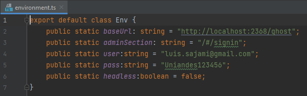

# PruebasAutomatizadas
Para los contenidos a desarrollar en la asignatura Pruebas Automatizadas

# Integrantes del equipo

| Nombre                           | Correo                    |
|----------------------------------|---------------------------|
| Luis Soler Sajami                | l.solier@uniandes.edu.co  |
| David Orlando Zuñiga Boyacá      | d.zunigab@uniandes.edu.co |
| Edgar Fernado Melara Guevara     | e.melara@uniandes.edu.co  |
| Cristian Leonardo Toro Sarmiento | c.toros@uniandes.edu.co   |

# Funcionalidades bajo pruebas

1. Crear Página
2. Publicar página
3. Eliminar Página
4. Editar NavBar
5. Navegación NavBar
6. Asignar Tag
7. Eliminar Tag
8. Editar Tag
9. Crear Post
10. Eliminar Post
11. Crear Usuario
12. Editar Usuario
13. Eliminar Usuario
14. Suspender Usuario
15. DeSuspender Usuario

# Escenarios de prueba

* PA001. Edición de página: Al hacer log-in en la aplicación, se accede al módulo de creación de nueva página y se crea una nueva página. Luego se accede a lista de páginas y se verifica la creación.
* PA002. Publicación programada de página
* PA003. Borrar página existente: Teniendo una página (vinculada o no en navbar) creada en el sitio, se verifica que se pueda borrar y que no quede listada en la sección de Páginas después del borrado
* PA004. ...
* PA005. Enlazar nueva página en componente navbar: Al crearse una nuevá pagina vinculada al sitio, se vincula en navbar del sitio y se logra navegar a la misma desde dicho navbar
* PA006. Renombrar página y componente navbar asociado: Teniendo una página enlazada al navbar del sitio, se cambia el nombre de la página y del componente navbar (más su enlace interno) y se verifica que se puede acceder aun a la página editada desde el navbar.
PA007. Renombrar página vinculada en navbar: Teniendo una página enlazada al navbar del sitio, se cambia el nombre de la página (pero no se modifica item navbar) y se verifica que al hacer clic en el enlace ya existente desde navbar no se pueda acceder a la pagina editada.
* PA008. ...
* PA009. ...
* PA010. ...
* PA011. Borrar post existente en el sitio: Teniendo un post ya publicado en el sitio, se procede a borrar el mismo desde herramienta de administración, y se verifica su eliminación en la sección de gestión de posts
* PA012. Publicar post en draft: Habiendo generado un borrador o draft de un post para publicar en el sitio, se ingresa nuevamente a la página de edición del mismo, se edita y se publica, y luego se verifica su publicación en el sitio.
* PA013. ...
* PA014. ...
* PA015. Verificar cambio de contraseña exitoso: Habiendo ingresado a la página de gestión del sitio con cuenta tipo admin, se cambia la contraseña asociada a la cuenta a una nueva, y se verifica que el login fracase con la credencia vieja y que el login opere con la nueva clave.
* PA016. Verificar cambio de e-mail exitoso: Habiendo ingresado a la página de gestión del sitio con cuenta tipo admin, se cambia el e-mail asociada a la cuenta por uno diferente, y se verifica que el login fracase al ingresar con el e-mail antiguo y que el login opere al usar el e-mail agregado.
* PA017. ..
* PA018. ...
* PA019. Suspender a un usuario activo: Habiendo ingresado a la sección de Staff en el sitio de administración, se selecciona un usuario activo y se aplica suspensión del mismo desde la página de administración del susodicho
* PA020. Remover la suspensión puesta sobre un usuario: Habiendo ingresado a la sección de Staff en el sitio de administración, se selecciona un usuario suspendido y se remueve la suspensión sobre el mismo desde la página de administración del susodicho.

# Instrucciones de ejecución de código de escenarios de pruebas

## Precondiciones generales

1. Instalar node v14.15.0 segun su sistema operativo. Se recomienda NVM tanto para Windows como para sistemas Linux. Instrucciones disponibles tanto para Linux: (https://github.com/nvm-sh/nvm) o su spin'off en Windows (https://github.com/coreybutler/nvm-windows)
2. Tener instalada una instancia de Ghost v3.41.1. Más información en https://ghost.org/docs/install/local/
3. Descargar los contenidos del repositorio en su carpeta de preferencia, sea por descarga de ZIP o por "git clone https://github.com/clts-uniandes/PruebasAutomatizadas.git"

## Cypress

1. Instalar Cypress desde consola de comandos con el comando "npm install cypress"
2. Ejecutar el comando "cypress open". Espere a que apareza la pantalla de cypress
3. Hacer click en "select manually"
4. Escoger la ubicación "pruebasautomatizadas/Cypress/pruebas_e2e/" desde la carpeta donde descargó el contenido de repositorio
5. Configure usuario de login de admin de Ghost en el archivo Cypress/pruebas_e2e/cypress/fixtures/loginData.json. Cambie los valores "username1" y "password1" segun el usuario admin disponible en Ghost
6. Haga clic en la prueba que desee ejecutar (elementos tipo PAxyz.spec.js ) 

## Kraken
### Prerequisitos:
   - NodeJS 12 o posterior
   - Ghost v3.41.1
   - Ejecutar la instancia de Ghost con el comnando `ghost start`
### Ejecución de pruebas:
1. Ingresar al direcorio kraken `cd kraken`
2. Instalar dependencias `npm install`
3. Configurar el archivo `kraken/properties.js` con los parametros `USERNAME`, `PASSWORD`, `LOGIN_URL` y `BASE_URl`
4. Ejecutar el comando `./node_modules/kraken-node/bin/kraken-node run`

## Playwright

Prerequisitos:

- Instalar NodeJs ver 14+

Pasos para ejecutar los test

1. Ingresar al directorio playwright `cd Playwright`
2. Ejecutar el comando `npm install`
3. Configurar las variables `user` y `pass` de ghost en archivo `envitonment.ts`
   que se encuentra en la carpeta `util`

4. Ejecutar el comando `npx playwright test`

